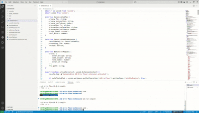

# AI Error Fixer - VSCode Extension

A powerful VSCode extension that automatically detects and fixes Python errors using AI, providing clean, production-ready code with primary and alternative solutions.

## Features

- **AI-Powered Error Detection**: Automatically detects and analyzes Python errors in your code
- **Consolidated Fixes**: Processes multiple errors simultaneously and provides unified solutions
- **Clean Code Output**: Returns properly formatted, executable code without line numbers or markers
- **Dual Solutions**: Offers both primary and alternative fixes with confidence scores
- **Smart Caching**: Remembers previous fixes to speed up common error patterns
- **Auto-Fix on Save**: Optional automatic error fixing when you save Python files
- **Visual Feedback**: Beautiful webview panel showing detailed explanations and code diffs

## Demo



## Requirements

- **VSCode**: Version 1.85.0 or higher
- **Python**: Version 3.8 or higher
- **Docker** (recommended) or Python environment for running the API
- **Ollama** (optional): For enhanced AI-powered fixes using CodeLlama

## Installation

### 1. Install the VSCode Extension

```bash
# Clone the repository
git clone https://github.com/yourusername/ai-error-fixer.git
cd ai-error-fixer

# Install dependencies
npm install

# Build the extension
npm run compile

# Package the extension
vsce package

# Install in VSCode
code --install-extension ai-error-fixer-*.vsix
```

### 2. Start the API Backend

#### Option A: Using Docker (Recommended)

```bash
# Start all services
docker-compose up -d

# Pull the CodeLlama model (optional, for AI features)
docker exec -it ai-error-fixer-ollama-1 ollama pull codellama:latest

# Check service health
curl http://localhost:8000/health
```

#### Option B: Manual Setup

```bash
# Navigate to API directory
cd api

# Install Python dependencies
pip install -r requirements.txt

# Start the API server
python main.py

# In another terminal, start Ollama (optional)
ollama serve
ollama pull codellama:latest
```

## Usage

### Basic Usage

1. Open a Python file with errors
2. Press `Ctrl+Shift+P` (or `Cmd+Shift+P` on Mac)
3. Type "AI Error Fixer: Fix Errors" and press Enter
4. Review the proposed fixes in the side panel
5. Click "Apply Primary Fix" or "Apply Alternative Fix"

### Auto-Fix on Save

Enable auto-fix to automatically process errors when saving:

1. Click the "AI Fix: ON/OFF" button in the status bar
2. Or use Command Palette: "AI Error Fixer: Toggle Auto Fix"

### Keyboard Shortcuts

- `Ctrl+Shift+F` (or `Cmd+Shift+F` on Mac): Manually trigger error fixing

## Configuration

Add these settings to your VSCode `settings.json`:

```json
{
  "aiErrorFixer.autoFixEnabled": true,
  "aiErrorFixer.apiUrl": "http://127.0.0.1:8000"
}
```

### Available Settings

| Setting | Type | Default | Description |
|---------|------|---------|-------------|
| `aiErrorFixer.autoFixEnabled` | boolean | `true` | Enable automatic error fixing on save |
| `aiErrorFixer.apiUrl` | string | `http://127.0.0.1:8000` | API backend URL |

## Architecture

### Components

```
┌─────────────────────┐
│  VSCode Extension   │
│  (TypeScript)       │
└──────────┬──────────┘
           │
           │ HTTP/REST
           │
┌──────────▼──────────┐
│   FastAPI Backend   │
│   (Python)          │
└──────────┬──────────┘
           │
           ├─────────────┐
           │             │
┌──────────▼──────────┐ │
│  Rule-Based Fixes   │ │
│  (Fallback)         │ │
└─────────────────────┘ │
                        │
           ┌────────────▼──────────┐
           │  Ollama + CodeLlama   │
           │  (Optional AI)        │
           └───────────────────────┘
```

### Key Features

- **Error Parser**: Intelligent Python error message analysis
- **Clean Code Extractor**: Removes line numbers and debugging markers
- **Fix Generator**: Creates both AI and rule-based solutions
- **Caching System**: Stores and retrieves previous fixes
- **Batch Processor**: Handles multiple errors efficiently

## API Endpoints

### Main Endpoints

- `POST /fix-errors-consolidated` - Process multiple errors at once
- `POST /fix-error` - Process a single error
- `GET /health` - Check API and service health
- `GET /cache/stats` - View cache statistics
- `POST /cache/clear` - Clear the fix cache

### Example API Request

```bash
curl -X POST http://localhost:8000/fix-errors-consolidated \
  -H "Content-Type: application/json" \
  -d '{
    "errors": [
      {
        "error_message": "SyntaxError: invalid syntax",
        "code_snippet": "def hello(\n    print(\"Hello\")",
        "line_number": 1,
        "error_id": "error_1"
      }
    ],
    "file_path": "/path/to/file.py"
  }'
```

## Development

### Building from Source

```bash
# Install dependencies
npm install

# Run in development mode
npm run watch

# Run tests
npm test

# Package extension
npm run package
```

### Running Tests

```bash
# Extension tests
npm test

# API tests
cd api
pytest tests/
```

## Troubleshooting

### Common Issues

**Extension not connecting to API**
- Verify the API is running: `curl http://localhost:8000/health`
- Check the API URL in VSCode settings
- Ensure Docker containers are running: `docker-compose ps`

**AI fixes not working**
- Verify Ollama is running: `curl http://localhost:11434/api/tags`
- Check if CodeLlama model is installed: `ollama list`
- The extension will fall back to rule-based fixes if AI is unavailable

**Fixes not applying**
- Make sure the file is saved and not read-only
- Check VSCode output panel for error messages
- Try manually copying the fix code

## Performance

- **Cache Hit Rate**: ~70-80% for common error patterns
- **Processing Time**: 
  - Rule-based: < 100ms
  - AI-powered: 2-5 seconds
  - Cached: < 10ms
- **Concurrent Requests**: Supports up to 50 errors per batch

## Contributing

Contributions are welcome! Please follow these steps:

1. Fork the repository
2. Create a feature branch: `git checkout -b feature-name`
3. Make your changes and commit: `git commit -am 'Add feature'`
4. Push to the branch: `git push origin feature-name`
5. Submit a pull request

### Development Guidelines

- Follow TypeScript and Python best practices
- Add tests for new features
- Update documentation as needed
- Ensure all tests pass before submitting

## License

MIT License - see [LICENSE](LICENSE) file for details

## Acknowledgments

- Built with [FastAPI](https://fastapi.tiangolo.com/)
- AI powered by [Ollama](https://ollama.ai/) and [CodeLlama](https://github.com/facebookresearch/codellama)
- VSCode Extension API

## Support

- **Issues**: [GitHub Issues](https://github.com/sajidashaik44/ai-error-fixer/issues)
- **Discussions**: [GitHub Discussions](https://github.com/sajidashaik44/ai-error-fixer/discussions)
- **Email**: support@example.com

## Roadmap

- [ ] Support for more programming languages (JavaScript, TypeScript, Java)
- [ ] Integration with popular linters and formatters
- [ ] Custom rule creation interface
- [ ] Team collaboration features
- [ ] Cloud-based fix suggestions
- [ ] IDE integrations (PyCharm, IntelliJ)

## Changelog

### v1.0.0 (2024-09-30)
- Initial release
- Consolidated error fixing
- Clean code output
- Primary and alternative solutions
- Docker support
- Ollama integration

---

**Made with ❤️ by developers, for developers**
